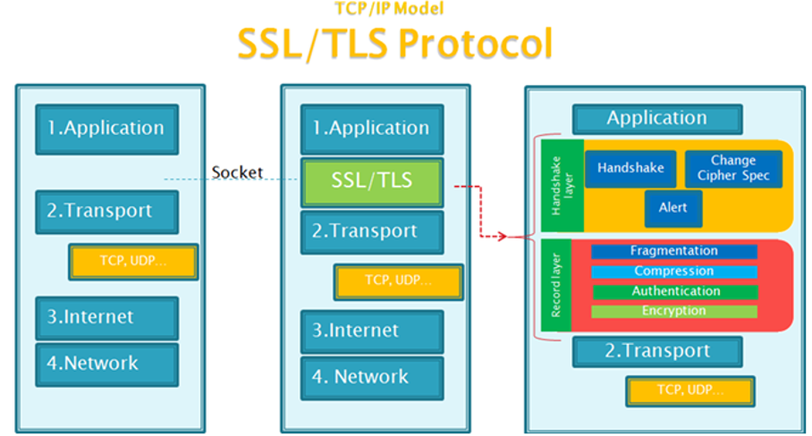
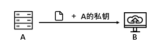
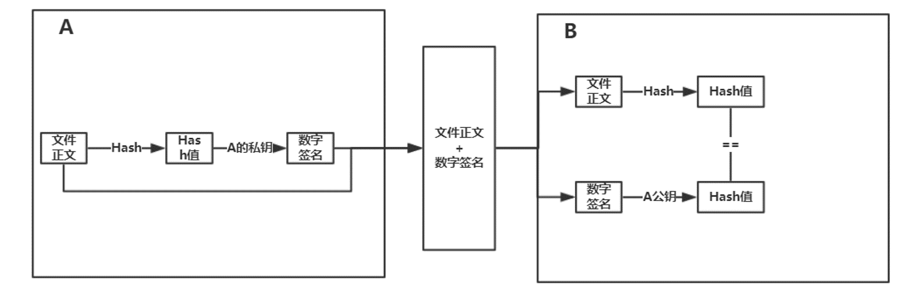
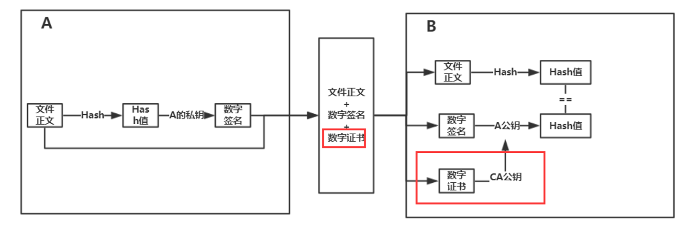
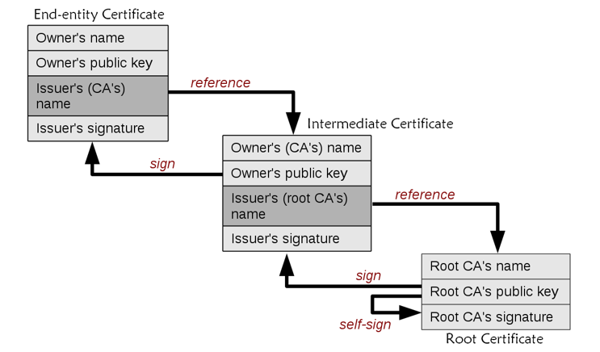
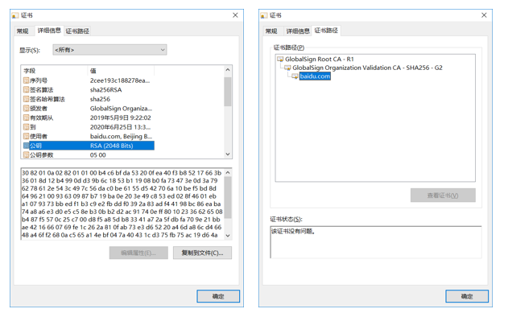
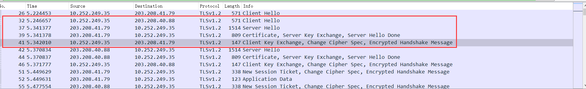

# SSL及其加密通信过程
[TOC]

## 从HTTP说起
HTTP（Hyper TEXT Transfer Protocol超文本传输协议）是目前互联网上应用最为广泛的一种网络协议，在网络模型中位于应用层，用于在Web浏览器和网站服务器之间传递信息，但是HTTP协议以明文的方式发送内容，不提供任何数据加密，攻击者能够很轻易截获传输的信息，造成的影响：1.你不希望被看到的信息被看到，2.如果传输的数据是可执行文件而被攻击者修改，这样可能对计算机的损害。

为了解决HTTP这一缺陷，HTTPS（Hyper TEXT Transfer Protocol over Secure Socket Layer）协议出现。HTTPS是在HTTP的基础上加入SSL协议。传输以密文传输，保证数据传输的安全(文件是否被修改)以及确认网站的真实性（确定发送者的真实身份）。

    HTTPS=HTTP+SSL
## SSL协议在网络模型中的位置

### SSL和TLS的关系

我们在搜SSL的时候，一般是SSL和TLS一起出现的，其实本质上SSL和TLS是一个东西，SSL是1994年美国[网景][Netscape Communications Corporation]开发的协议，目的是为了解决web通信不安全的问题，1996年发布SSL3.0，1997年一个叫IETF的专门制定互联网协议的任务组试图将SSL进行标准化，并且在SSL3.0的基础上发布TLS1.0，之后SSL就以TLS这个名字出现。最终在1999年被记录到[RFC][Request For Comments]（一系列编号排定的文件，意即“请求协议”，包含了关于Internet的几乎所有重要的文字资料）。

### SSL 协议的构成

上图最左边是标准的[TCP/IP的四层模型][TCP/IP四层模型]，从上到下分别是应用层、传输层、网络层、链路层，而新加入的SSL协议则位于传输层和应用层中间，它利用传输运输层提供的端到端的通信服务为应用层提供加密传输服务。SSL又可以被细分为SSL记录协议和SSL握手协议，这两个协议也是有上下层的关系，SSL记录协议主要是提供数据的封装，压缩，认证，加密等基本功能的支持，SSL握手协议则是利用SSL记录协议提供的这些服务，在实际数据传输开始前双方协商加密算法，交换密钥等。详细过程我们后面再说。

[Request For Comments]:https://baike.baidu.com/item/RFC/1840?fr=aladdin
[Netscape Communications Corporation]:https://baike.baidu.com/item/%E7%BD%91%E6%99%AF/70176?fr=aladdin
[TCP/IP四层模型]:https://blog.csdn.net/qq_29344757/article/details/78377500

## 几个密码学相关概念

- 密钥：在加密或者解密算法中的输入参数
- 对称加密：加密和解密用的是同一个密钥
- 非对称加密：加密和解密用的是不同密钥，分别被称为公钥和私钥
- 公钥：可以被公开的密钥
- 私钥：不能被公开只能自己保存的密钥

其中公钥和私钥的关系是：用公钥加密的密文只能用对应的私钥进行解密，用私钥加密的密文只能用对应的公钥进行解密。

## SSL加密传输的过程 

### 为什么不直接用对称加密进行加密传输

其实对称加密比非对称加密出现的早，而且它还有相对非对称加密来说更快的加密/解密速度，它管理自己的密钥更加简单，但是为什么没有人用对称加密直接用数据的加密传输呢？

主要原因还是对称加密的密钥分发困难，就比如说我要下载服务器上的一份文件，如果用对称加密的话首先要做的就是密钥分发，如果直接不附加任何东西的发给你，很可能被别人截获，而密钥被别人截获的话是一间很危险的事情。所以一般不会直接用对称加密进行传输，SSL的做法是通过非对称加密的方式交换对称加密的密钥，再通过对称加密的方式数据传输。

### 非对称加密的传输方式

前面说了对称加密不能直接用于数据加密传输，我们再来看看非对称加密。

利用非对称加密的方式有两种，考虑B要向服务器A下载一份文件，一种做法是A用B的公钥加密，发送过去后B用自己的私钥解密，另一种做法是A用自己的私钥加密，B用A的公钥进行解密。

我们现在看一下第一种方式：A用B的公钥加密，B用自己的私钥解密，想一想这种做法有没有什么问题？

问题就是A向B发送的数据可能被中间人C截获，由于公钥是公开的，C可以冒充A发送文件给B。B接受到文件后：第一它不知道文件是不是来自A，第二它不知道文件是否被人修改。

我们再看一下第二种方式：A用自己的私钥进行加密，B用A的公钥进行解密。这种方式解决了上面的问题了吗？

上面的问题确实解决了，如果B能够用A的公钥进行解密顺利的解密，这份文件一定是来自A的，并且文件没有被更改，否则无法顺利解密。

我们再来想一想这种方式好吗。非对称加密是一个比较耗时的过程，如果文件比较大的话，就会产生非常严重的延时，对用户体验极度不好。其实用户B的目的是能够下载到A的并且没有被修改的文件，并没有必要对整个文件进行加密，那如何做到即快速又安全呢？就是数字签名！

### 数字签名

我们先来看一下数字签名的工作流程

1. A先对这封Email执行哈希运算得到hash值简称“摘要”，取名h1
2. 然后用自己私钥对摘要加密，生成的东西叫“数字签名”
3. 把数字签名加在Email正文后面，一起发送给B。
4. B收到邮件后用A的公钥对数字签名解密，成功则代表Email确实来自A，失败说明有人冒充
5. B对邮件正文执行哈希运算得到hash值，取名h2
6. B 会对比第4步数字签名的hash值h1和自己运算得到的h2，一致则说明邮件未被篡改。

这样一来是不是完美了？有没有上面致命缺陷？答案是有的。缺陷就是B得到的A的公钥不一定是A的功能，它也是可能被修改的，如果有人把你得到的A的公钥改成自己的，别人就有可能冒充A。需要有其它东西证明A公钥的正确性。那就是数字证书！

### 数字证书

数字证书是一个专门的颁发数字证书的机构ca颁发的，他将签发者、A的加密算法、A的公钥、证书到期时间等信息用签发机构的私钥进行加密得到一份数字证书。

我们再来看一下数字证书工作流程：

签名的步骤和上面一样，只是A发送的数据包括文件正文、数字签名、数字证书，接收方B通过CA机构的公钥将数字证书解密得到A公钥等信息，用于后续文件验证等操作。

这个过程还有问题吗？——CA公钥如何验证真假。是不是可以和验证A公钥的方法一样找给CA机构签发证书的CA机构，那这个CA又怎么验证，似乎进入恶性循环...

### 证书信任链

证书认证是一级一级的认证的，我们称最顶部的证书为根证书。操作系统或者浏览器会内置一些根证书，我们对这些证书是据对信任的。

以百度服务器的数字证书为例说明证书信任链。

1. 当client端访问baidu.com的时候，baidu的server会将baidu.com证书发送给client端。
2. client端的操作系统或者浏览器中内置了根证书，但是client端收到baidu.com这个证书后，发现这个证书不是根证书签发，无法根据本地已有的根证书中的公钥去验证baidu.com证书是否可信。
3. 请求到证书后发现GlobalSign Organization Validation CA - SHA256 - G2证书是由根证书签发，而本地刚好有根证书，于是可以利用根证书中的公钥去验证GlobalSign Organization Validation CA - SHA256 - G2证书，发现验证通过，于是信任GlobalSign Organization Validation CA - SHA256 - G2证书。
4. GlobalSign Organization Validation CA - SHA256 - G2证书被信任后，可以使用GlobalSign Organization Validation CA - SHA256 - G2证书中的公钥去验证baidu.com证书的可信性。验证通过，于是信任baidu.com证书。

windows可以通过`certmgr.msc`命令查看系统内置的证书

我们可以在浏览器上查看目标服务器的数字证书

## SSL握手协议

上面介绍的知识客户端单方向的从服务器获取文件，如果服务器要和客户端进行交互，上面的步骤效率就不是很高，一种做法就是通过上面介绍的方法建立链接生成一个对称加密的密钥，之后用对称加密的方式进行交互，这就是SSL握手协议做的事情。具体步骤如下：

这整个握手过程都是不加密的，整个通话的安全性全在于第三个随机数能不能被破解，虽然理论上这个随机数不能被破解，但是为了足够的安全，他们把这个握手阶段默认的算法改成[DH算法][迪菲-赫尔曼密钥交换]。双方只要交换各自的参数就可以算出这个随机数。

其具体过程如下：

通过抓包的方式也可以看到上述整个的握手过程：

[迪菲-赫尔曼密钥交换]:https://zh.wikipedia.org/wiki/%E8%BF%AA%E8%8F%B2-%E8%B5%AB%E7%88%BE%E6%9B%BC%E5%AF%86%E9%91%B0%E4%BA%A4%E6%8F%9B	"迪菲-赫尔曼密钥交换 维基百科"

## 参考内容

[通俗理解数字签名，数字证书和https](https://www.jianshu.com/p/4932cb1499bf)

[HTTPS协议、TLS协议、证书认证过程解析](https://www.cnblogs.com/snowater/p/7804889.html)

[图解SSL/TLS协议](http://www.ruanyifeng.com/blog/2014/09/illustration-ssl.html)

