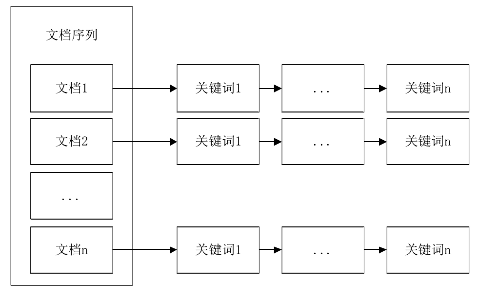
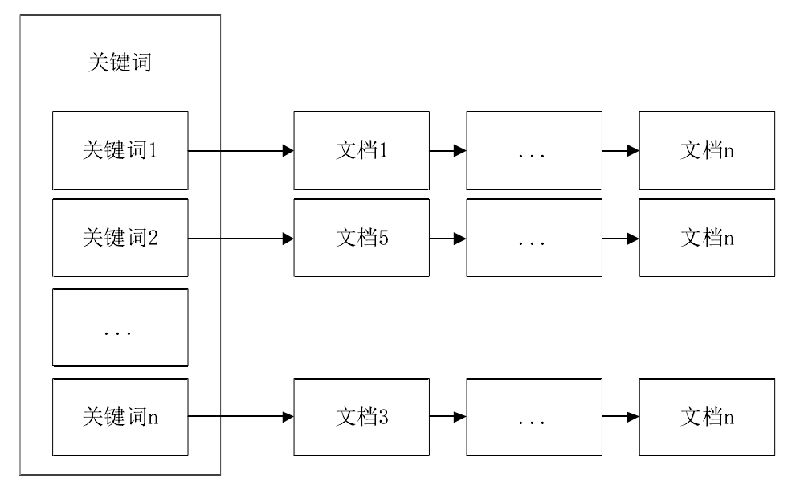
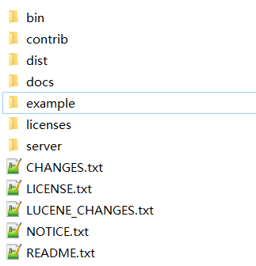

# 全文搜索引擎介绍--以Solr为例

## 目录
- [全文搜索引擎介绍及原理](#全文搜索引擎介绍及原理)
    - [搜索引擎的分类](#搜索引擎的分类)
    - [全文搜索引擎介绍](#全文搜索引擎介绍)
    - [倒排索引介绍](#倒排索引介绍)
    - [创建索引](#创建索引)
        - [1. 输入文档（Document）](#1-输入文档document)
        - [2. 将文档传给分词组件（Tokenizer）](#2-将文档传给分词组件tokenizer)
        - [3. 将得到的词元（Token）传给过滤器（Filter）](#3-将得到的词元token传给过滤器filter)
        - [4. 将得到的词（Term）传给索引组件（Indexer）](#4-将得到的词term传给索引组件indexer)
    - [检索索引](#检索索引)
- [Solr介绍及简单使用](#solr介绍及简单使用)
    - [Solr与Lucene的联系和区别](#solr与lucene的联系和区别)
    - [Solr的下载、安装及运行](#solr的下载安装及运行)
    - [Solr的优点](#solr的优点)
    - [Solr在Web架构中的地位](#solr在web架构中的地位)
    - [Solr的架构](#solr的架构)
    - [Solr core介绍](#solr-core介绍)
    - [Schema配置](#schema配置)
    - [使用演示](#使用演示)
- [参考文献](#参考文献)

## 全文搜索引擎介绍及原理

说到全文搜索引擎，大家可能会想到搜索引擎，那么全文搜索引擎和搜索引擎有什么关系呢？搜索引擎其实有多种，而全文搜索引擎只是其中一种，也是我们一般接触到最多的一种。

### 搜索引擎的分类

搜索引擎可以分为以下几类：

1. 全文搜索引擎。这也是今天的重点，下面会详细介绍。
2. 目录搜索引擎。目录搜索引擎主要是按类目对网站进行收录，在查询时可以不用输入关键字，只要按照目录一层一层往下查找就行了。常见的目录搜索引擎有新浪、雅虎等。
3. 元搜索引擎。接收用户查询后，在多个搜索引擎上进行搜索，并将结果返回给用户。比如说你在某个元搜索引擎上搜索“solr”，它可能调用会Baidu、Google等去进行搜索，然后将结果处理后返回给你。常见的有Zapmeta、Dogpile等。
4. 垂直搜索引擎。是应用于某一个行业、专业的搜索引擎，是搜索引擎的延伸和应用细分化。垂直搜索引擎为用户提供的并不是上百甚至上千万相关网页，而是范围极为缩小、极具针对性的具体信息。因此，特定行业的用户更加青睐垂直搜索引擎。

当然还有其他类型的搜索引擎，在此就不一一列举了。

### 全文搜索引擎介绍

下面进入正题：全文搜索引擎。

全文搜索引擎，顾名思义，就是基于全文搜索的搜索引擎。全文搜索引擎是我们最常接触的搜索引擎，常用的有Baidu、Google等。全文搜索引擎会从网上提取各种信息，然后对其建立索引并将索引储存到索引库中。当用户提交搜索请求时，引擎会在索引库中进行检索，然后按照一定的规则对搜索到的结果进行打分排序，最后将排序后的结果返回给用户。

下图是全文搜索引擎的工作流程：

由图可知，全文搜索引擎的工作步骤大致可分为：数据采集、数据索引、数据搜索和用户接口。

数据采集主要是通过爬虫从网上爬取各种资源保存到本地数据库中。

数据索引会对数据进行分词、打分等处理，然后将处理后的数据以**倒排索引**结构储存到索引库中。

数据搜索会根据用户输入的查询条件去检索索引库，然后将匹配的结果打分排序后返回给用户。

用户接口指用户与全文搜索引擎进行交互的页面或API，用户通过接口来向搜索引擎发出搜索请求。

### 倒排索引介绍

全文搜索引擎处理的通常是海量的来自网页、文件系统等的非结构化数据，而传统关系型数据库对非结构化数据的管理是很有限的，于是诞生了索引库。全文搜索引擎的索引库中的数据是按倒排索引结构储存的。倒排索引结构记录的是字符串与文档之间的关系，这样的结构非常便于我们根据关键字找到包含它的所有文档，这也是全文搜索引擎所需要做的。

在继续讲解倒排索引之前，我们先来看看与之相对应的正排索引。

由图可见，正排索引建立的是文档（文档编号）到字符串的映射。使用正排索引，我们能方便地查找特定文档中有那些关键字；但反过来，如果我们需要查找包含某个特定关键字的文档，我们只能选择遍历来分别判断每个文档是否包含着个关键字，显然这是极为低效的。

再来看看倒排索引的结构。

倒排索引建立的是字符串到文档（文档编号）的关系，解决了正排索引按关键字查找文档龟速的问题。想象一下，我们是怎样使用Baidu后Google的：假设我们需要查找Solr相关资料，我们输入“Solr”并提交（输入），然后希望搜索引擎返回的是包含“Solr”的网页（输出）。而全文搜索引擎已经建立了“Solr”到相关网页的映射并将其储存在倒排索引结构中，它在查找这些网页时，就相当于在一个map中通过key得到其所对应的value，这是非常迅速的。

我们已经看到了使用倒排索引带来的好处，但显然这也存在一个明显的缺点：建立倒排索引库（**后文的“索引库”均指“倒排索引库”**）是非常耗时的。在建立索引库的过程中，需要找到每个关键字对应的文档然后将结果汇总。可以想象，在处理海量数据的时候，这个过程会消耗大量的时间。然而，这实际上也并不是什么严重的问题。我们使用索引库，目的是加快检索速度，提升用户体验。建立索引库的龟速用户也体验不着，而且建立索引库完全可以放到机器空闲时去做，因为大多数情况下全文搜索引擎并不是搜集到了数据就会去更新索引库（实际上也无法保证索引库总是实时的），一般都是设置一些定时任务在特定时间来更新索引库。索引库一旦建成，没特殊情况的话即是一劳永逸，当要加入新的索引时，更新就行了，也不必完全重建。

### 创建索引

下面来看看创建索引的过程。主要有以下4步。

> 注：此过程为一般过程，具体搜索引擎的处理不尽一致。

#### 1. 输入文档（Document）

指要索引的对象，包括网页、文件系统中的文件、数据库数据等。

为了使这个过程便于理解，我们假设现在有以下两个文档：

文档1：

    Solr is highly reliable, scalable and fault tolerant, providing distributed indexing, replication and load-balanced querying, automated failover and recovery, centralized configuration and more.

文档2：

    Solr powers the search and navigation features of many of the world's largest internet sites.    

#### 2. 将文档传给分词组件（Tokenizer）

分词组件用于将文档拆成一个个词元（Token）。就英文而言，它会根据标点符号、空格等将文档中的词拆开。对不同的语言有不同的分词规则，如通过空格进行分词显然对中文不适用，这时就需要用到特定的分词器（如中文分词器IKAnalyzer）。

经过此步处理，上述文档形成以下两个词元集合：

文档1：

    "Solr", "is", "highly", "scalable", "and"...

文档2：

    "Solr", "powers", "the", "search", "and"...

#### 3. 将得到的词元（Token）传给过滤器（Filter）

过滤器的作用时对词元进行再处理后生成词，处理过程通常包括大小写转换、词根转换、除去停用词等。

大小写转换非常ez，比如“Solr”会被转换成“solr”。

词根转换就是将单词转换成其词根模式，比如“highly”转换成“high”、“providing”转换成“provide”等。

除去停用词就是忽略那些经常使用的无太大意义的单词，比如英文中“am”、“is”、“are”、“I”等和中文中“的”、“了”等通常情况下都是会被忽略的。

处理后，上述文档如下：

文档1：

    "solr", "high", "reliable", "fault", "tolerant", "provide"...

文档2：

    "solr", "power", "search", "navigation", "feature"...

#### 4. 将得到的词（Term）传给索引组件（Indexer）

索引组件会合并相同的词并记录包含它的文档，并将这样一条条的数据添加到倒排索引表中（类似于上图3：倒排索引结构所示）。当然一般此步还会记录每个词出现的频率和位置等。

### 检索索引

到这里，已经能够轻易地搜索到索引库中的内容了，比如我们搜索“solr”会返回包含“solr”的两个文档。但现在其实还有很多缺陷，比如如果搜索的是“Solr”是没有结果的，因为索引库中的词是按小写储存的，所以在检索前，还需要对搜索关键词进行大小写转换。类似地，还需要进行词根转换、同义词转换等以便于找到相关的文档。

现在再来思考另外一个过程，假设我想搜索“Solr”这个引擎相关的资料，我在搜索引擎中输入了“solr”并检索到了相关的文档，但返回的结果前部分全是一个叫做“Solr”的人，而我所需要的Solr引擎相关的文档却被排在后面（那我是不是要怀疑“Solr”这个人是不是搞了什么竞价排名之类的暗箱操作了呢？），那这个搜索引擎一定是有问题的。这就要求对检索结果进行打分排名。打分排名的规则很多，比如你要搜索的关键字在某个文档中出现的次数特别多，那么这个文档当然应该排在前面；又比如你要搜索的关键字在某个文档中出现的绝对次数不多但占了该文档中很大的比重（表明该文档与这个关键字很相关），那么相应地文档也应该得到一个较高的分数。

## Solr介绍及简单使用

好了，讲了那么多原理，在看看Solr到底长什么样之前，我还要扯点其他的。

### Solr与Lucene的联系和区别

Lucene和Solr都是Apache旗下的开源项目。

Lucene是一个全文搜索引擎开发工具包，它并不是一个搜索引擎，而只是一个搜索引擎框架。就是说，Lucene比较底层，对数据的索引、搜索过程都需要我们根据API自己去写。使用Lucene的好处在于容易满足个性需求，但一个明显的缺点就是开发效率低下，这在快节奏的当下几乎是致命的。

Solr是基于Lucene实现的一个全文搜索引擎，属于一个单独的Web应用，下载下来就可以直接运行了。使用Solr的话我们主要干的就是配置而不是编码，就和使用数据库时我们重点是建表而不是写一个数据库一样，配置完以后就可以导入数据、搜索数据了。可以看到，Solr的使用非常简单，这也是很多大公司或机构使用Solr的原因。像Instagram、NetFlix、NASA、白宫都用到了Solr。

### Solr的下载、安装及运行

又扯了一些，终于进入了实际操作环节。

Solr官方下载地址：[http://archive.apache.org/dist/lucene/solr/](http://archive.apache.org/dist/lucene/solr/)

考虑到官网下载速度对国内用户不由友好，推荐使用国内镜像[https://mirrors.tuna.tsinghua.edu.cn/apache/lucene/solr/](https://mirrors.tuna.tsinghua.edu.cn/apache/lucene/solr/)。

下载好解压后目录如下：

进入bin目录，命令行执行"./solr start"即使Solr运行了起来，通过访问[http://localhost:8983](http://localhost:8983)即可看到Solr的管理页面。

### Solr的优点

好了，已经目睹Solr的真容了，让我们静下来，再看看一些相关的理论介绍。

Solr还有很多优点，我一一来介绍下：

1. 独立的企业级搜索服务，基于http服务以类REST API对外提供服务。刚刚已经讲到，Solr是一个独立的Web应用，可以在它的管理界面操作它，但更多的是通过http请求进行数据的增删改查以及其他操作。
2. 近实时的索引能力。当数据发生改变时，你可以通过http请求去更新相应的索引来实现同步性。当通常并不会一有数据发生改变就去更新索引，因为这样太消耗性能。通常的做法是利用Quartz这样的任务管理器去执行定时任务，比如说在每天半夜去更新索引。
3. 先进的全文检索能力。这我也不知道怎么说，每个全文搜索引擎肯定都认为自己的全文检索能力是先进的。
4. 综合的管理界面。Solr提供了一个管理界面，这个我们待会儿会看到。
5. 高伸缩和容错能力。Solr支持分布式部署（SolrCloud）和备份。

### Solr在Web架构中的地位

在一个使用Solr的Web架构中，Solr与其他服务端程序并行运行。
例如，在一个商城系统中，在线商店应用程序将提供用户界面、购物车以及为最终用户购买的方式；而库存管理应用程序将允许商店员工编辑产品信息。产品元数据将保存在某种数据库以及 Solr 中。用户通过用户界面进行商品的搜索时，这个End User Application就调用了Solr提供的搜索服务。

### Solr的架构

一般学习每个框架，我们都要来看它的架构，Solr也不例外。

如图所示，我们注意到下方绿色部分，说明Solr是基于Lucene的。上方的Request Handlers和Response Writers用于接受http请求和和进行响应（前面已经提到，Solr是一个Web应用）。Search Component是搜索时用到的一些组件，如查询组件（Query）、高亮组件（Highlighting）等。Schema和Config是Solr的配置部分，利用Solr，我们可以自定义字段类型、分词器、过滤器等。Data Import Handler用于从数据库中导入数据来建立索引库。还有一些其他的组件，在此不一一介绍了。

### Solr core介绍

core是Solr中的一个重要概念，是指运行在Solr服务器中的唯一命名的、可管理和可配置的索引库。一台Solr服务器是可以有多个core的。

为什么会用到多个core呢？这主要是为了管理的方便。不同的文档拥有不同的模式（字段构成、索引方式、存储方式），如商品数据和新闻数据就有不同的字段构成以及不同的字段索引、存储方式。就需要分别用两个内核来索引、存储它们。同时这也是为了避免冲突，比如商品数据中我们把id定为long类型，而在新闻数据中我们把id定位string类型，这种冲突的定义是不能出现在同一个core中的。假如可以的话，solr怎么知道你要使用的到底是long还是string呢？

在使用Solr之前，我们需要创建一个core。可以在管理界面Core Admin选项中点击Add Core按钮创建一个新的索引库，默认为new_core。

但这时会报错：

> Error CREATEing SolrCore 'new_core': Unable to create core [new_core] Caused by: Can't find resource 'solrconfig.xml' in classpath or 'E:\solr\solr-8.0.0\server\solr\new_core'

此时，进入解压后文件夹中server/solr，发现已经创建了一个空的new_core文件夹，将configsets&#92;_default\下的conf文件夹copy到new_core中，**刷新管理页面**后再次Add Core即成功。实际上，Solr完全应该在创建new_core时自动生成默认配置文件，但不知出于什么原因它需要我们自己去copy配置文件，个人感觉这是个挺蠢的设计。

### Schema配置

进入new_core下的conf目录中，发现有个managed-schema文件，打开后可以发现这是用来配置字段（field）、字段类型（fieldType）等的。下面来简单介绍下各种可配置对象。

- fieldType：字段类型（如date、varchar、int等，可按数据库中的字段类型理解）
- field：字段（如id、name等，可按数据库中的字段理解）
- copyField：复制字段，可以将多个field配置到同一个copyField中，这样，在对该copyField进行检索时，会对其内部包含的所有field进行检索（例如，考虑一个商品的索引库，我们可以创建一个叫做keyword的copyField，在其中包含name和description这两个field，这样，在对关键字（keyword）进行检索时就会搜索商品名称（name）和商品描述（description））
- dynamicField：动态字段，可以动态地为名称满足特定格式但未设置type属性的field添加特定的字段类型。如managed-schema定义了一个name未*_s的dynamicField，如果你使用了一个叫做description_s但未指定fieldType的field的话，Solr会默认该字段类型为string类型。
- uniqueKey：唯一主键。

### 使用演示

实际使用Solr时，还需要进行中文分词器配置、数据导入配置等，由于篇幅问题，本文中并不打算对此进行详细讲解。推荐一篇挺不错的关于Solr使用的文章[《Solr7.5安装和使用详细教程（单机版）》](https://blog.csdn.net/qwqw3333333/article/details/84333510)。

## 参考文献

- 赵亮. 基于Solr的企业搜索引擎研究与实现[D].中国地质大学(北京),2017.
- http://www.cnblogs.com/guochunguang/articles/3641008.html

